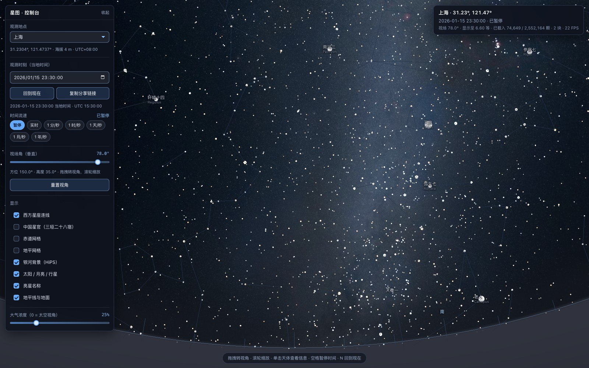

# 星图 xingtu

浏览器端的星空 / 天象仪，风格参照 Stellarium Web。相机位于单位天球球心，
用**立体投影**（Stellarium 的默认投影）把全天渲染到一张画布上，
支持 255 万颗恒星的真实位置、自行、光行差与地平坐标换算。



## 特性

| | 功能 | 说明 |
|---|---|---|
| 1 | 天球视角 | 拖拽转视角，滚轮 / 双指缩放改变视场角（0.2° – 140°） |
| 2 | 立体投影 | `R = 2·tan(θ/2)`，宽视场下不变形 |
| 3 | 星点渲染 | 自定义 ShaderMaterial；亮度按视星等、颜色按 B-V 色指数 |
| 4 | 位置精度 | 自行推算 + 周年与周日光行差 + 岁差章动，实测最差 **0.71″** |
| 5 | 观测者设置 | 29 个预设地点（南半球 22 个），经纬度/时间/流速可调 |
| 6 | 地平坐标系 | 地平线、方位刻度、地面遮挡、东南西北标记 |
| 7 | 太阳系 | 太阳、月亮、八大行星；**月相是算出来的**，不是贴图 |
| 8 | 亮星标签 | 默认 mag<2，随视场角自动展开；中文星名优先 |
| 9 | 网格 | 赤道网格与地平网格，可分别开关 |
| 10 | 星座连线 | 西方 88 星座 + 中国三垣二十八宿（312 星官） |
| 11 | 银河背景 | CDS HiPS `CDS/P/Mellinger/color` |
| 12 | 大气 | 消光（Kasten-Young 空气质量）+ 月光/暮光天光 + 浓度滑块 |
| 13 | 信息卡 | 点选天体显示星等、色指数、光谱型、赤经赤纬、自行、星表编号 |
| 14 | URL 分享 | 地点、时刻、视角、显示开关、大气浓度全部进链接 |
| 15 | 界面 | 原生控件，对比度足够，一眼能看出可操作 |

## 快速开始

```bash
# 1. 依赖（需要 Node.js 20+ 与 pnpm）
pnpm install

# 2. 下载原始数据（约 200 MB，支持断点续传）
pnpm run data:download

# 3. 预处理，生成 public/data/（约 80 MB，全部在 .gitignore 内）
pnpm run data:all

# 4. 启动
pnpm dev            # http://127.0.0.1:5173
```

`pnpm run data:all` 会依次跑三个脚本：

| 脚本 | 输入 | 输出 |
|---|---|---|
| `scripts/build-stars.ts` | `data/raw/athyg_v32-*.csv.gz` | `public/data/stars/`（4 档二进制分块 + 星名表 + manifest） |
| `scripts/build-constellations.ts` | `data/raw/constellations/` | `public/data/constellations/`（西方 + 中国连线 + 中文星名） |
| `scripts/build-hips.ts` | CDS `hips2fits` 服务 | `public/data/milkyway/`（银道全天贴图，约 1 MB） |

三个脚本都会打印详细的统计信息（文件大小、星数、每个天区的分布、核对结果）。
星表预处理约 5 秒，星座约 2.5 秒，银河贴图约 10 秒（取决于网速）。

> **注意**：`public/data/` 与 `data/raw/` 都**不提交进 git**。
> 仓库里只有源代码和预处理脚本，数据完全可以从公开源重建。

### 其他命令

```bash
pnpm test           # Vitest 单元测试（23 条）
pnpm typecheck      # tsc --noEmit，strict 全开
pnpm lint           # ESLint
pnpm build          # 生产构建
pnpm preview        # 预览生产构建
```

## 部署到 GitHub Pages

仓库里带了 [.github/workflows/deploy-pages.yml](.github/workflows/deploy-pages.yml)，
推到 `main` 就自动构建并发布，也可以在 Actions 页面手动触发。

### 首次使用要手动开一次

**Settings → Pages → Build and deployment → Source 选 `GitHub Actions`。**

> ⚠️ 别选成 `Deploy from a branch / docs`。本仓库有个 `docs/` 目录，
> 但那是精度文档和截图，不是站点产物。选错了会看到一个只有两张文件的页面。

开启后推一次代码，站点会发布到 `https://<用户名>.github.io/<仓库名>/`。

### 流水线要解决的两个问题

**一、数据不在仓库里。** `public/data/` 有 89 MB、`data/raw/` 有 194 MB，
都按 AGENTS.md 的要求进了 `.gitignore`；而 Pages 只能服务仓库里的文件。
所以流水线在 CI 里把数据重新生成一遍：

```
pnpm run data:download   # 194 MB，用 actions/cache 长期缓存，第二次起跳过
pnpm run data:stars      # 约 5 秒
pnpm run data:constellations
pnpm run data:hips       # 从 CDS 现拉，continue-on-error
pnpm run build
```

`data:hips`（银河贴图）这一步挂了不会拦住部署 —— 程序在没有银河贴图时
会自动降级，只是天上少了银河。这样 CDS 服务抖动不会让你发不了版。

**二、项目页挂在子路径下。** 站点地址是 `https://<用户名>.github.io/<仓库名>/`
而不是域名根目录。如果还用 Vite 默认的 `base: '/'`，打包出来的
`/assets/xxx.js` 会被解析到域名根目录，**整站白屏**。

工作流里通过环境变量注入正确的 base：

```bash
VITE_BASE=/<仓库名>/ pnpm run build
```

`VITE_BASE` 是从 `github.event.repository.name` 动态拼的，仓库改名不用改配置。
本地开发不设这个变量，保持 `/`。运行时拉取的数据（`data/stars/manifest.json` 等）
本来就都是相对路径，会跟着页面 URL 走，不需要额外处理。

### 本地验证项目页构建

部署前可以自己验一遍，不用等 CI：

```bash
VITE_BASE=/xingtu-deepseek/ pnpm run build
VITE_BASE=/xingtu-deepseek/ pnpm run preview
# 打开 http://127.0.0.1:4173/xingtu-deepseek/
```

### 体积与配额

发布产物约 **93 MB**（其中 3842 个 `.bin` 分块占大头）。GitHub Pages 的限制是
单站 1 GB、每月 100 GB 流量，都在安全范围内。

### 关于银河贴图的许可证

再说一次，因为公开部署会放大这个问题：`CDS/P/Mellinger/color`
是 **All rights reserved**，把它放进公开站点属于再分发。如果这不适合你的用途，
删掉工作流里的 `预处理银河背景` 那一步就行 —— 原始数据缓存已经存下 194 MB，
后续不需要重新下载，程序会自动降级为没有银河。

### 换成别的静态托管

产物是纯静态的（`dist/` 目录），不放 `data/raw/` 与 `public/data/` 的话
任何静态托管都能用。要注意两点：一是仍需提供 `public/data/` 里的数据，
二是如果用子路径访问，构建时要带上 `VITE_BASE`。

## 架构

```
src/
├── astro/            纯计算层，不依赖 Three.js，可在 Node 里直接跑单测
│   ├── coordinates.ts    赤道 ↔ 地平、岁差章动矩阵、方位角/高度角
│   ├── properMotion.ts   自行推算（大圆上的精确旋转）
│   ├── aberration.ts     周年 + 周日光行差
│   ├── time.ts           儒略日、地方视恒星时
│   ├── solarSystem.ts    日月行星位置、月相、亮边方向
│   ├── atmosphere.ts     空气质量、消光、月光与暮光天光
│   └── starColor.ts      B-V → 色温 → 线性 sRGB
├── data/             数据层
│   ├── healpix.ts        HEALPix NESTED 实现（移植自 astrometry.net）
│   ├── starCatalog.ts    二进制分块解析、LOD 选块、并发与 LRU
│   └── constellations.ts 星座连线加载
├── render/           Three.js 渲染层
│   ├── shaders.ts        全部 GLSL
│   ├── skyRenderer.ts    渲染器总装
│   ├── backgroundLayer.ts  银河 + 天光 + 地面（全屏三角形）
│   ├── starField.ts      星点（每个分块一个 Points）
│   ├── lineLayer.ts      线段（网格 / 星座 / 地平线）
│   ├── bodyLayer.ts      太阳系天体（带月相）
│   └── picking.ts        屏幕点选
├── ui/               控件层
│   ├── controls.ts       控制面板
│   ├── labelLayer.ts     HTML 标签叠加层
│   ├── infoCard.ts       信息卡
│   └── format.ts         时间与时区格式化
├── state.ts          应用状态与 29 个地点预设
├── skyContext.ts     每帧的天文上下文（UI 与渲染的唯一耦合点）
├── url.ts            URL 序列化
└── main.ts           装配
```

## 几个实现要点

### 投影由着色器负责，不用透视相机

天空的投影在顶点着色器里手工算 `gl_Position`：

```
正向：p = u.xy · 2 / (1 + u.z)          u 是相机空间单位方向
反向：dir = (4p.x, 4p.y, 4−R²) / (4+R²)  R² = p.x² + p.y²
屏幕半高对应 R_v = 2·tan(fov/4)，ndc = (p.x / (R_v·aspect), p.y / R_v)
```

背景层用反向公式逐像素重建天球方向，星点/线段/天体用正向公式，
两边公式严格互逆，所以任何图层都天然对齐。

### 线性 HDR 合成

所有图层先渲染到一张 **HalfFloat 线性** RenderTarget，最后一遍统一做
指数色调映射与 sRGB 编码。这样星点之间的加法混合发生在物理亮度上；
直接往 sRGB 缓冲上叠加会让重叠的星芒偏亮，亮度关系不再是物理的。

### 精度：实测最差 0.71″

链路是「自行 → 光行差 → 岁差章动 → 地平旋转」，基准来自
**Skyfield 1.55 + JPL DE421** 离线生成的 12 组数据（4 颗星 × 3 个时刻），
观测点上海，几何地平坐标不含折射。

```
最差总角距 0.71″   平均 0.34″
```

残差来自本实现有意不建模的高阶项（周年视差、光行时、相对论光行差、
太阳引力偏折），详见 [docs/precision-reference.md](docs/precision-reference.md)。

### 两级 LOD

星表按视星等切 4 档，亮的两档全天整体加载，暗的两档按 HEALPix 切片：

| 档 | 星等 | 布局 | 星数 | 体积 |
|---|---|---|---|---|
| A | < 6.5 | 全天单文件 | 8,807 | 0.27 MB |
| B | 6.5 – 8.5 | 全天单文件 | 65,842 | 2.01 MB |
| C | 8.5 – 10.5 | HEALPix nside=8（768 天区） | 462,061 | 14.12 MB |
| D | ≥ 10.5 | HEALPix nside=16（3072 天区） | 2,015,454 | 61.60 MB |

运行时按视场角决定加载哪几档，再按视线方向做 HEALPix 圆盘查询，
只请求视野覆盖到的天区；整块在地平线以下的直接跳过。
放大到 2.2° 视场时实测只驻留 12 个分块（A/B 各一，C 4 个，D 6 个）。

### 二进制格式

每个分块是 SoA 布局，单星 32 字节，各段起始地址都对齐到 4 字节，
可以直接建类型化数组视图：

```
偏移        内容                  类型
0           文件头 32 字节         见 scripts/build-stars.ts
32          positions count×3     float32   赤道 J2000 单位向量
32+12n      magnitudes count      float32   视星等
32+16n      rgba      count×4     uint8     rgb = 线性 sRGB；a = B-V 编码
32+20n      properMotion count×2  float32   μ_α*、μ_δ（mas/yr）
32+28n      starIds   count       uint32    AT-HYG 行 id
```

### 数据源上踩到的坑

这三个都会让结果静默出错，预处理脚本里都做了处理与注释：

1. **AT-HYG 的 `ra` 列单位是「小时」不是度**。`Number(null)` 类的问题不致命，
   但漏乘 15 会让全天星图整体错位。
2. **AT-HYG 的位置历元是 J1991.25，不是 J2000**。99.93% 的行来自 Tycho-2。
   必须先推算 8.75 年自行再存单位向量，否则高自行星能差到 10″ 量级。
3. **`athyg_v32-2.csv.gz` 没有表头**，必须按内容判断。

HEALPix 实现移植自 astrometry.net 的 `healpix.c`，并用本地编译出的 C 参考实现
生成 267 条测试向量逐条比对（像素→坐标 141 条、坐标→像素 126 条），全部精确一致。

## 测试

```bash
pnpm test
```

23 条单测：

- `src/data/healpix.test.ts`（8 条）—— 对照 astrometry.net C 参考实现、
  往返一致性、面积均匀性、圆盘查询覆盖
- `src/astro/coordinates.test.ts`（15 条）—— 对照 Skyfield/JPL 基准、
  亚角秒断言、岁差反证、纯公式与 astronomy-engine 交叉验证、
  自行与光行差量级

其中两条是**防回归**性质的，对应两个真实踩过的坑：

- `rotationToMat3` 的探针测试：astronomy-engine 的 `RotationMatrix.rot[i][j]`
  存的是矩阵的**转置**（其 `RotateVector` 算的是 `v'ᵢ = Σⱼ rot[j][i]·vⱼ`），
  按行主序直接用会让整个天球镜像。
- GLSL 的 `mat3` 是**列主序**，而项目里的 `Mat3` 是行主序，
  所有矩阵上传必须经过 `toGlslMat3()` 转置一次。

## 数据来源与许可证

**代码用 MIT（见 [LICENSE](LICENSE)），但数据不是。**
`public/data/` 里的产物是下表这些数据集的派生作品，主要是 **CC BY-SA 4.0**，
页面页脚与本节都如实标注。

| 数据 | 用途 | 许可证 | 署名 |
|---|---|---|---|
| [AT-HYG v3.2](https://codeberg.org/astronexus/athyg)（David Nash） | 255 万颗恒星的位置、星等、色指数、自行、星名 | **CC BY-SA 4.0** | `AT-HYG (David Nash), CC BY-SA 4.0` |
| ↑ 上游：Tycho-2 (ESA 2000)、Hipparcos-2、Gaia DR3 | 同上 | 各自公开许可 | 见 AT-HYG 文档 |
| [Stellarium skycultures](https://github.com/Stellarium/stellarium/tree/master/skycultures) | 西方 88 星座与三垣二十八宿连线、中文星名 | **CC BY-SA 4.0** | `Sky culture data from Stellarium (https://stellarium.org), CC BY-SA 4.0` |
| [CDS HiPS `CDS/P/Mellinger/color`](https://alasky.cds.unistra.fr/MellingerRGB/) | 银河背景贴图 | **Copyright 2000-2017 Axel Mellinger. All rights reserved.** | `Milky Way panorama © Axel Mellinger (http://www.milkywaysky.com/), 2009 PASP 121, 1180` |
| [astrometry.net `healpix.c`](https://github.com/astrometry/astrometry) | HEALPix 参考实现与测试向量 | BSD-3-Clause | 仅用于测试基准，不分发其代码 |

### ⚠️ 关于银河贴图的额外说明

Mellinger 全天银河全景的许可证是 **All rights reserved**，不是自由许可证。
本项目把它作为**非商业的教育 / 演示用途**使用并完整署名；
如果要用于商业产品，**必须**替换成别的数据源，
或直接关掉它（控制面板里取消「银河背景（HiPS）」，
或者干脆不跑 `pnpm run data:hips`，程序会自动降级为没有银河）。

### 许可证的传染性

AT-HYG 本身就是 CC BY-SA 4.0，所以 `public/data/` 里的星表分块、
星名表、星座连线 JSON 整体都处在 **ShareAlike** 之下 ——
即使换成 BSD-3-Clause 的 d3-celestial 星座数据也无法让整个产物脱离 CC BY-SA。
本仓库选择直接用许可证更一致的 Stellarium 数据。

## 已知限制

- **没有实现真正的 HiPS 瓦片客户端**。银河背景是在构建期用 CDS 官方的
  `hips2fits` 服务重投影成一张等距圆柱全天贴图，运行时不依赖 HiPS 服务。
  这样做简单可靠，但代价是失去了按需加载高分辨率瓦片的能力。
- **星表只到约 13 等**。Tycho-2 的完备极限约 11.5 等，AT-HYG 补了部分 Gaia 数据，
  13 等以下只有零星几万颗。想看到更深的星需要接入 Gaia DR3 子集。
- **深空天体（星云、星系、星团）没有实现**，数据管线留了接口但没接。
- **未建模的高阶项**：周年视差（最大 0.38″）、光行时回推、太阳引力偏折。
- **WebGL 线宽恒为 1 px**：地平线与网格线想做粗只能用带状几何体，目前没做。
- **软件渲染下性能有限**：无头截图用的 SwiftShader 只有 20 FPS 左右；
  真实 GPU 上 255 万颗星的 LOD 实测很流畅。

## 下一阶段建议

按「收益 / 成本」排序：

1. **接入 Gaia DR3**。用 VizieR TAP 拉取 G < 15 的子集（约 2000 万颗），
   新增一档 E（HEALPix nside=32 或 64）。现有分块管线不用改，
   只需要在 `build-stars.ts` 里多一个数据源分支。
2. **深空天体**。Messier + NGC/IC 星表（OpenNGC，CC BY-SA）接入同一套
   分块与点选机制，用 Sprite 渲染，配合信息卡显示视直径与类型。
3. **真正的 HiPS 瓦片客户端**。实现 HEALPix 瓦片到球面的映射与按需加载，
   就能支持任意 HiPS 巡天（DSS、PanSTARRS、2MASS），而不只是一张贴图。
4. **周年视差**。星表里 97.6% 的行有距离，加上这一项可以把残差从 0.7″ 压到 0.1″。
5. **粗线与发光**。用带状几何体重做线条渲染；给亮星加一点 bloom，
   现在的点扩散函数已经够用但不够「亮」。
6. **移动端手势**。双指旋转、惯性滑动、长按选择；目前只支持双指缩放。
7. **导出与录制**：把当前视角导出成高分辨率图片，或者把时间流逝录成视频。
